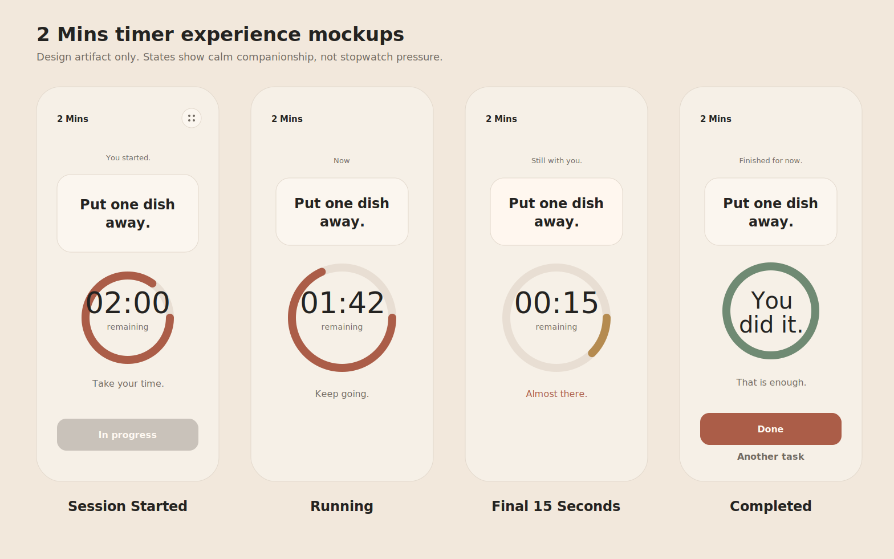

# Timer Experience Design

Status: Design deliverable only  
Source task: `tasks/014a_timer_experience_design.md`  
Scope: UX specification and visual mockups for the active 2-minute session

No production code, timer logic, countdown implementation, persistence, navigation, haptics, analytics, notifications, or React Native components are specified here.

## Design Summary

The timer is quiet companionship while the user completes one tiny action. It should feel like the app is staying with the user, not measuring or judging them.

The experience is built around three emotional qualities:

- Calm: no urgency, no pressure language, no aggressive motion.
- Clarity: task title, remaining time, and current state are always understandable.
- Confidence: the user is gently reassured that starting counts and finishing is encouraged, not demanded.

The timer must not feel like a stopwatch, Pomodoro, productivity tracker, game, streak system, or performance tool. It is a two-minute container for one small action.

## Screen Flow

### 1. Session Started

Purpose: reassure the user that the session has begun.

Primary feeling: "You started. That is already useful."

Visible content:

- Header: `2 Mins`, existing settings affordance may remain if already present.
- Small status label: `You started.`
- Task card: selected task remains the visual anchor.
- Progress indicator: circular ring appears full or nearly full with `02:00` inside.
- Remaining label: `remaining`.
- Supporting sentence: `Take your time.`
- Disabled secondary button: `In progress`, using disabled styling.

Behavioral guidance:

- Do not celebrate this moment.
- Do not transform the task card into the timer.
- Keep the task title above the timer so the user remembers what they are doing.
- The transition from Home should be a soft fade or simple content replacement.

### 2. Running

Purpose: provide the primary timer experience.

Primary feeling: "Stay with this one small thing."

Visible content:

- Status label: `Now` or similarly quiet contextual copy.
- Task card: compact but still clear and centered.
- Circular progress ring: large, centered, readable.
- Remaining time: example `01:42`.
- Remaining label: `remaining`.
- Supporting sentence: `Keep going.`
- No extra controls unless implementation later requires an escape path for safety or accessibility.

Behavioral guidance:

- Timer is prominent, but the task remains visible above it at all times.
- Supporting copy should update at most every 20-30 seconds.
- No milliseconds.
- No ticking visual treatment.
- No repeated visual emphasis.

### 3. Final 15 Seconds

Purpose: make the ending feel slightly warmer without creating urgency.

Primary feeling: "You are close, and you are doing fine."

Visible content:

- Status label: `Still with you.`
- Task card: same task title, unchanged hierarchy.
- Circular progress ring: same size and placement.
- Remaining time: example `00:15`.
- Remaining label: `remaining`.
- Supporting sentence: `Almost there.`

Visual changes:

- Ring color may transition from copper accent `#AB5D48` toward warm amber `#B58B50`.
- Task surface may become subtly warmer, such as a slight paper warmth shift.
- Supporting sentence may use accent color.

Do not:

- Flash.
- Vibrate.
- Shake.
- Bounce.
- Pulse.
- Turn red.
- Use alarm-like language.
- Increase font weight or size dramatically.

### 4. Completed

Purpose: acknowledge completion softly.

Primary feeling: "You did it. That is enough."

Visible content:

- Status label: `Finished for now.`
- Task card: task remains visible for continuity.
- Completion ring: complete circle in success green `#6F8A73`.
- Main message inside ring: `You did it.`
- Supporting sentence: `That is enough.`
- Primary action: `Done`.
- Quiet secondary action: `Another task`.

Behavioral guidance:

- This is not an achievement screen.
- Do not show confetti, fireworks, XP, streaks, badges, scores, or productivity language.
- `Done` closes or resolves the session in the future implementation.
- `Another task` is quiet and secondary.

## Visual Hierarchy

Recommended hierarchy for every timer state:

1. Status
2. Task
3. Timer
4. Supporting text
5. Primary action, when present

The task title must remain visible at all times. The timer must never replace it.

### Layout

- Overall screen: safe-area aware, warm paper background `#F6F0E7`.
- Content width: max 560 on wide screens.
- Horizontal padding: 24 default, 20 on compact devices.
- Main content: vertically centered with enough top and bottom breathing room.
- Task card: surface `#FBF6EF`, border `#E2D8CC`, radius 24.
- Timer ring: centered below task card, large enough for comfortable reading.
- Primary actions: full width, 56 high, radius 16, placed after supporting text.

### Spacing Guidance

- Header to status: 48-64.
- Status to task card: 20-24.
- Task card to timer ring: 40-48.
- Timer ring to supporting sentence: 40-48.
- Supporting sentence to actions: 32-40.
- Button stack gap: 4-8.

Compact screens may reduce vertical gaps by one spacing step, but the task title and timer must remain readable without visual crowding.

### Typography

- App name/header: label, 15-18, medium weight.
- Status label: caption, 13/18, secondary or muted color.
- Task title: titleLarge 24/30 for timer screens; display 40/48 can remain on Home only.
- Timer numerals: 48-56, medium weight, tabular numeric treatment if available.
- `remaining` label: caption or 14, secondary color.
- Supporting sentence: body, 16/24, secondary color.
- Completion message: display or headline scale only inside the completion ring.
- Buttons: label, 15/20, semibold.

Long task titles:

- Wrap naturally across 2-3 lines.
- Keep centered alignment.
- Scale down only after wrapping cannot preserve the hierarchy.
- Never truncate the task title in the active timer experience.

### Color

Use the current Home palette:

- Background: `#F6F0E7`
- Surface: `#FBF6EF`
- Surface secondary: `#EEE5DA`
- Text primary: `#242321`
- Text secondary: `#716A62`
- Text muted: `#9A9188`
- Accent: `#AB5D48`
- Accent soft: `#F1DDD4`
- Border: `#E2D8CC`
- Divider: `#E8DED3`
- Success: `#6F8A73`
- Warning/warm final-seconds accent: `#B58B50`
- Disabled: `#C9C2BA`

Final seconds may become warmer, but never alarming. Avoid red for timer states.

## Motion

Motion should be gentle and almost invisible.

Allowed:

- Ring progression.
- Soft fade between state text.
- Opacity transition on supporting copy.
- Subtle ring color transition during final 15 seconds.
- Completion state fade-in.

Timing:

- Fast: 140ms for small opacity changes.
- Normal: 220ms for text/state fades.
- Slow: 320ms for completion reveal.
- Supporting copy changes no more often than every 20-30 seconds.

Avoid:

- Bounce.
- Shake.
- Pulse.
- Flash.
- Spin.
- Countdown jumps.
- Repeated looping animation.
- Any motion that asks for attention more than once.

Reduced motion:

- Keep ring state changes functional.
- Remove fades where necessary.
- Use instant text changes.
- Do not rely on animation to communicate progress.

## Accessibility

- Task title remains visible and readable in all states.
- Screen reader order: status, task title, remaining time, supporting sentence, available actions.
- Announce session start once: `Task started.`
- Announce remaining time in plain language, such as `1 minute 42 seconds remaining`.
- Do not announce every second.
- In final 15 seconds, announce only if the app later defines a non-disruptive accessibility reason; default should be no extra interruption.
- Completion announcement: `You did it.`
- Support Dynamic Type.
- Preserve 44 x 44 minimum touch targets.
- Use high-contrast text colors on paper and surface backgrounds.
- Do not use color as the only state change; pair final seconds with copy like `Almost there.`
- Ensure `In progress` communicates disabled state to assistive technology.
- Completed actions should expose clear labels: `Done` and `Another task`.

## Future Implementation Notes

- Build the timer view as a design translation of this specification, not as a generic stopwatch screen.
- Keep timer engine, session transitions, persistence, history, analytics, haptics, and notifications out of the first implementation unless separate tasks explicitly add them.
- Preserve the task-first hierarchy from Home into the active session.
- Treat completion as a soft acknowledgement, not a gamified reward.
- Use the existing theme tokens instead of adding a new timer palette.
- If a cancel/stop affordance becomes necessary later, make it quiet, secondary, and clearly non-destructive in tone.
- Validate on compact phones, large phones, dark mode, high contrast, large Dynamic Type, and reduced motion before implementation is accepted.
